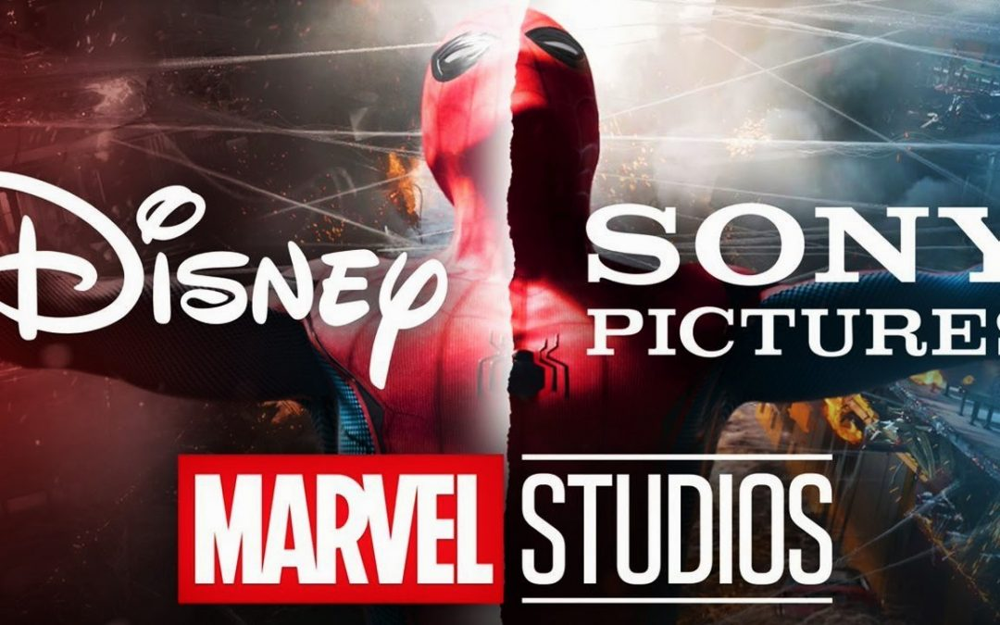
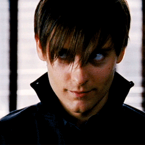

<style type="text/css">

@font-face {
    font-family: 'Avengeance Heroic Avenger Normal';
    font-style: normal;
    font-weight: normal;
    src: local('Avengeance Heroic Avenger Normal'), url('AVENGEANCE HEROIC AVENGER.woff') format('woff');
}
@font-face {
    font-family: 'Avengeance Heroic Avenger Normal';
    font-style: normal;
    font-weight: normal;
    src: local('Avengeance Heroic Avenger Normal'), url('AVENGEANCE HEROIC AVENGER.woff') format('woff');
}
@font-face {
    font-family: 'Avengeance Heroic Avenger Italic';
    font-style: normal;
    font-weight: normal;
    src: local('Avengeance Heroic Avenger Italic'), url('AVENGEANCE HEROIC AVENGER AT.woff') format('woff');
}
@font-face {
    font-family: 'Avengeance Heroic Avenger Italic';
    font-style: normal;
    font-weight: normal;
    src: local('Avengeance Heroic Avenger Italic'), url('AVENGEANCE HEROIC AVENGER AT.woff') format('woff');
}
@font-face {
    font-family: 'Avengeance Heroic Avenger Bold';
    font-style: normal;
    font-weight: normal;
    src: local('Avengeance Heroic Avenger Bold'), url('AVENGEANCE HEROIC AVENGER BD.woff') format('woff');
}
@font-face {
    font-family: 'Avengeance Heroic Avenger Bold Italic';
    font-style: normal;
    font-weight: normal;
    src: local('Avengeance Heroic Avenger Bold Italic'), url('AVENGEANCE HEROIC AVENGER BI.woff') format('woff');
}
@font-face {
    font-family: 'Avengeance Heroic Avenger Bold';
    font-style: normal;
    font-weight: normal;
    src: local('Avengeance Heroic Avenger Bold'), url('AVENGEANCE HEROIC AVENGER BD.woff') format('woff');
}
@font-face {
    font-family: 'Avengeance Heroic Avenger Bold Italic';
    font-style: normal;
    font-weight: normal;
    src: local('Avengeance Heroic Avenger Bold Italic'), url('AVENGEANCE HEROIC AVENGER BI.woff') format('woff');
}

@font-face {
    font-family: 'Spidey Normal';
    font-style: normal;
    font-weight: normal;
    src: local('Spiderman-Homecoming'), url('Spiderman-Homecoming.ttf') format('0tf'),
        url('spiderman-homecoming-webfont.eot?#iefix') format('embedded-opentype'),
         url('spiderman-homecoming-webfont.woff2') format('woff2'),
         url('spiderman-homecoming-webfont.woff') format('woff'),
         url('spiderman-homecoming-webfont.svg#spiderman-homecomingregular') format('svg');
}

body{ /* Normal  */
      font-size: 16px;
  }
td {  /* Table  */
  font-size: 15px;
  text-align:center;
}
th {  /* Table  */
  font-size: 20px;
  text-align:center;
}
h1.title {
  font-family: 'Spidey Normal';
  text-align: center;
  font-size: 65px;
  color: #FFC133;
  font-weight: bold;
  text-shadow: 4px 2px 0px #C70039;
}
h1.subtitle {
  font-family: 'Spidey Normal';
  font-size: 60px;
  color: #4F17A4;
  font-weight: normal;
  
}
h1 { /* Header 1 */
  font-size: 32px;
  color: DarkBlue;
}
h2 { /* Header 2 */
    font-size: 28px;
  color: DarkBlue;
    font-style: normal;
}
h3 { /* Header 3 */
  text-align: center;
  font-size: 20px;
  font-weight: bold;
  font-style: normal;
  font-family: "Papyrus";
  color: #2498FE;
}
h3.subtitle{
  text-align: center;
  font-size: 20px;
  font-weight: bold;
  font-style: normal;
  font-family: 'Spidey Normal';
  color: #2498FE;
  word-spacing: 0.55em;

}
h5{
  text-align: center;
  font-size: 20px;
  font-weight: bold;
  font-style: normal;
  font-family: 'Spidey Normal';
  color: red;
  word-spacing: 0.55em;

}
h4 { /* Header 3 */
  text-align: center;
  font-style: normal;
  font-size: 18px;
  font-family: "Times New Roman", Times, serif;
}
code.r{ /* Code block */
    font-size: 12px;
}
pre { /* Code block - determines code spacing between lines */
    font-size: 14px;
}
caption {
      color: red;
      font-weight: bold;
      font-size: 1.0em;
    } 
    tr:nth-child(even) {
  background-color: #f2f2f2
}
.avenge {
  font-family: 'Avengeance Heroic Avenger Bold';
  text-align: center;
  font-size: 14px;
  color: #4F17A4;
  font-weight: bold;
}
.avat {
  text-align: center;
  font-size: 22px;
  font-weight: bold;
  font-style: normal;
  font-family: "Papyrus";
  color: #2498FE;
}
.iron {
  text-align: center;
  font-size: 22px;
  font-weight: normal;
  font-style: normal;
  font-family: 'Iron Man Normal';
  color: #cfa904;
}
.tbltxt {
  text-align: center;
  font-style: normal;
  font-size: 18px;
}

</style>

```{r setup, include=FALSE}
knitr::opts_chunk$set(echo = TRUE)
library(plyr)
library(dplyr)
library(ggplot2)
#library(lubridate)
library(xts)
library(knitr)
library(xtable)
library(kableExtra)
library(here)
library(stargazer)
library(readxl)
library(scales)
library(plotly)
far_from_total <- 1131535039
far_from_cost <- 160000000
sony_dist <- 66677508
sony_lic <- 126500000+158000000 - 25000000
marvel_merch <- 1300000000
venom_total <- 856085151
venom_cost <- 100000000
venom_dist <- 52000000
venom_lic <- 100000000+100000000 - 25000000
merch_fee <- 35000000
feige_cost <- 2150000
```

</br>
<thead>
<tr class="header">
<center>

</center>
</tr>
</thead>

</table></br>
</br>


The recent negotiations of Sony and Disney have caught a lot of attention because it was first reported that no deal was reached between the two studios to make any more Spider-Man films together. This meant that Spider-Man, now a well established character in the MCU, would basically have to start all over again. As fan being torn apart by this news I decided to take a look at this situation in the context of game theory. Game theory uses mathematical models to explain the strategic interaction between rational decision-makers. Game theory has a lot of applications in economics because it can mathematically explain what decisions are more likely to be made than others based on simple economic assumptions. In this article I wish to take an objective viewpoint of the deals that have been made or refused in order to better understand why recent decisions have been made and what future deals could look like. 

# Negotiation 101

Around August 20th, 2019 rumors started circulating that Disney and Sony were in a standoff over contract renegotiation terms. It appeared that Sony was walking away from the negotiating table because Disney's proposed 50/50 co financing deal was too high of a price. 
</br>
<center>

</center>
</br>

This sent shock waves throughout Spider-Man fans everywhere because the newest installment was still in theaters and all of the sudden the plot line was ripped out from under them. 

# Sony, Marvel, and James Bond

<center><i>If past history was all there was to the game, the richest people would be librarians.</i> - Warren Buffett</center>
</br>

To better understand each side of the negotiation, it is important to see where Spider-man has been and why it matters so much to Sony, Disney, and Marvel. The web slinger was created in 1962 by Stan Lee and Steve Ditko for Marvel Comics. The first live-action film based on Spider-Man was created in 1969. In 1977 a film featuring Spider-Man premiered on CBS which became a weekly TV series. Popularity for Spider-Man quickly grew but was slightly derailed in 1983 when the poor performance of Superman 3 put super heroes on the chopping block for Hollywood. Marvel Comics had given an option for movie rights to director Roger Corman which he let expire in 1985. Marvel Comics then optioned the film to Cannon Films for $225,000 paid out over five years with an expiration of April 1990. This began a battle between studios, writers, and directors that would lead to years of no films produced. 

In 1985 Cannon Films was lead by cousins Henahem Golan and Yoram Globus. After purchasing rights from Marvel Comics that year, the work on the script began immediately. However, creative differences between the studio and Stan Lee kept production of the film at a standstill. As the script evolved the battle over the budget became the biggest hurdle. The super hero movie genre was still in its infancy and was a hard sell for allocation of big budgets. As Cannon descended into financial turmoil, Golan left to form 21st Century Film Corporation taking various properties with him including Spider-Man due to a settlement between Globus and Golan during the split. In order to raise production funds, Golan pre-sold television rights to Viacom and home video rights to Columbia Pictures. 

In 1989 Marvel and 21st Century made a new agreement which extended the expiration date to January 1992 if a movie wasn't made. Golan submitted a similar screenplay to the 1985 version for Spider-Man to Columbia but was held up again because Columbia requested more re-writes. The back and forth between Columbia and Golan started to get very close to that new expiration date. In 1992 Carolco Pictures, 21st Century, and Marvel made a new agreement that replaced the one prior. This agreement extended the expiration through May 1996. Carolco obtained the rights with the intention that James Cameron would direct a Spider-Man film. A dispute between rights given to James Cameron vs. Golan held up the production further in a legal battle that sparked legal suits from all studios associated with Spider-Man namely 21st Century, Carolco, Viacom, Sony (owned Columbia), and MGM. These legal battles led to the additional bankruptcy of 21st Century and Marvel. 

After the bankruptcy MGM acquired 21st Century's film library and assets including the rights to James Cameron's Spider-Man. Problem was the expiration date still held, giving the rights back to Marvel in 1996. MGM disputed this for years but finally in 1999, Marvel licensed Spider-Man to Columbia and by default Sony Pictures Entertainment. In an interesting twist, MGM CEO John Calley moved over to Columbia Pictures. With now an interest in the success of Columbia, he had to find a way to get MGM to concede in the legality of the Spider-Man rights. In a stroke of genius Calley announced that Columbia would produce an alternate 007 series based on material that Calley had acquired for Columbia. Both studios now faced rival projects that would undercut the long term stability of both studios. 

In March 1999 Columbia gave up its rights to create a new 007 series in exchange for MGM's claim to Spider-Man. Later in 2000 Columbia acquired the rights to all previously written scripts, but used options only on the material by James Cameron. Sam Raimi was hired as director and Spider-man went into production. 

So essentially James Bond saved the day here. The Pierce Brosnan version of course. If Columbia didn't have the James Bond rights to negotiate with, Spider-Man may have never seen the light of the box office and the super hero genre might not have had as much success. 

</br>
<thead>
<tr class="header">
<center>

</center>
</tr>
</thead>

</table></br>
</br>

While the full details of these negotiations aren't known, we do know that there is a rule that says if Sony fails to produce a Spider-Man movie every few years (4-5 years is the current assumption based on previous contracts) then the film rights expire and go back to Marvel. This is the reason we have some Spider-Man related property being released almost every few years. 

This brief summary of the journey Sony/Columbia has been on to acquire these rights should give you a better idea of why they are so valuable. Not only are they the asset that Sony can always count on but it took them 15 years to finally put a Spider-Man film out. Companies went out of business trying to get these rights sorted out in court. Sony shouldn't be criticized for playing hard to get and Disney shouldn't be criticized for sticking up for the value that they add. 

## Marvel Cinematic Universe

Disney bought Marvel Entertainment in 2009 for 4 billion which gave them access to every Marvel property except Spider-Man film rights. Lucky for Disney, Marvel came packaged with Spider-Man merchandising rights because those had never been sold to anyone and are worth about [1.3 billion a year](https://www.hollywoodreporter.com/news/superhero-earns-13-billion-a-748281), the most of any major super hero. In 2011 Sony and Marvel reached a deal where Sony would create <i>The Amazing Spider-Man</i> 1 and 2. Sony agreed to the costs and box office revenue while Marvel paid Sony 175 million for the distribution rights which carried another 35 million fee for each movie made. This additional 35 million could be reduced if the total box office clears 750 million. In 2015, the Marvel Cinematic Universe had been well established and it was time for another visit to the agreement now with Disney at the helm of Marvel Studios. This agreement allowed Spider-Man to appear for the first time in the MCU in <i>Captain America: Civil War</i> and in exchange Disney would co-create <i>Spider-Man: Homecoming</i> with Sony. 

Due to the success of the new Spider-Man solo film this deal was extended to include appearances for Spider-Man in <i>Avengers: Infinity War</i> and <i>Avengers: Endgame</i>. And again a solo film would be produced, <i>Spider-Man: Far From Home</i>. This is where the 5/95 deal came from, Spider-Man: Far From Home was completely financed by Sony with Sony taking 95\% of profits and Disney getting a well deserved 5\%. 

</br>
<center>
```{r, echo=FALSE}
spiderGross <- read.csv(here('spiderGross.csv'), header=TRUE, stringsAsFactors = FALSE)

p <- plot_ly(spiderGross, x = ~Movie, y = ~Gross, type = 'bar', color = I("red")) %>%
    add_trace(y = ~Rating, name = "Rating", marker = list(color = '#FFC133'), visible=F) %>%
    layout(title = "Spider-Man Movie Performance", showlegend = FALSE,
         xaxis = list(categoryarray = ~names, categoryorder = "array", title="Movie"),
         yaxis = list(title = "Worldwide Gross"),
          updatemenus = list(

      list(
        x=-0.1,
        xanchor ='middle',
        yanchor = 'top',
        pad = list(r=10, b=5),
        buttons = list(
          list(method = "update",
               args = list(list(visible=list(T,F)), list(yaxis=list(title="Worldwide Gross"))),
               label = "Performance"),
          list(method = "update",
               args = list(list(visible=list(F,T)), list(yaxis=list(title="Rotten Tomatoes Score"))),
               label = "Rating"))
      )
          )
    )

p
```
</center>


This chart shows the performance of each stand alone Spider-Man film. The Sony produced films seem to have been trending downward before <i>Spider-Man: Homecoming</i> came out. <i>Spider-Man: Far From Home</i> was far above any previous Spider-Man film perhaps because of the ties to <i>Avengers: Endgame</i>. To me it doesn't make sense for Sony to walk away from a deal when the most money was made with Disney producing. 


After <i>Far From Home</i> was released there a lot of unknowns with the impending renegotiation of Sony and Disney. Disney now has a lot more negotiating power than in the previous deals and Sony has a lot more incentive to make a deal because they just had their first billion dollar solo film. Sony is in a tough situation though because if Disney goes away they are on their own for Spider-Man otherwise the rights eventually go back to Marvel and Disney. There was a lot of drama and rumors around what was happening and after a while it looked like a deal would not be reached. But remaining optimistic about a future deal I consulted my game theory textbook. 

# Game Theory

The Disney/Sony negotiations can be simplified into a classical type of game that can be analyzed to show what each player should do. Before this analysis is presented, a little background in the language of game theory is essential to understanding the assumptions and equations that are used to arrive at conclusions. 

<ol>

<li><i>Zero-sum game:</i> In a <b>zero-sum game</b>, whatever one player wins the other loses. So if $a$ is the amount one player receives then the other player receives $-a$. Thus if a non zero-sum game is every other type of game. </li>

<li><i>Game (payoff) matrix:</i> A game matrix is an arrangements of payoffs to a specified player, typically the row player. These matrices list each possible decision for each player and the payoffs associated with the combination of decisions.  </li>

<li><i>Pure strategy:</i> A pure strategy is one of all possible actions a player may take in a game. </li>

<i>Mixed strategy:</i>A mixed strategy refers to actions that are randomized over all possible player actions. Each action has some probability of being taken. 

<li><i>Expected payoff:</i></li> The expectation of player payoffs. Each game matrix shows the expected payoffs for the set of pure strategies. If mixed strategies this becomes an average over all possible payout scenarios. 
<li><i>Bimatrix game: A bimatrix game contains two payoff matrices. Each player has their own payoff matrix because the game is nonzero sum. </i></li>
<li><i>Value of a game:</i> For a two player bimatrix game the values of each individual payoff matrix is the lowest the player can expect to be paid. </li>

<li><i>Safety Value:</i>In a bimatrix game the values of each individual payoff matrix are sometimes called 'safety' values indicating that the players will be paid out at least this value. </li> 


</ol>

# Notation

<ul>
<li>A vector has many technical definitions but here it is used as a single array of values such as $(1,2,3,4)$. </li>
<li>A matrix is a rectangular array of items arranged in rows ($i$) and columns ($j$). A matrix can be thought of as an array of vectors. Typically matrices are denoted by capital letters.</li>
<li>$D$ refers to the game matrix for Disney with $d_{ij}$ referencing the $i$th and $j$th component of that matrix. </li>
<li>$S$ refers to the game matrix for Sony with $s_{ij}$ referencing the $i$th and $j$th component of that matrix. </li>
<li>$X,Y$ are vectors corresponding to the player 1 & 2 strategies respectively. For example $X=(0,1)$ indicates that player 1 will choose strategy 2 with probability one.</li>
<li>$A^T$ indicates the transpose of matrix $A$.</li>
<li>$v(A)$ refers to the value of a game with payoff matrix $A$. For a bimatrix game this also refers to the "Safety Value". </li>
</ul>

# Assumptions

The list of assumptions is important because it determines what type of game we are analyzing and with what data to utilize. 

<ul>
<li> The game being played is a two player non-zero sum game. There are two players, Sony (or Columbia) and Disney that want to maximize box-office returns. This is non-zero sum game because a box office loss for one studio in a particular arrangement doesn't directly translate into a dollar for dollar increase in the payout of the other studio. Sure, one studio would be missing out on revenue but they wouldn't have to pay out or lose the money that the other is gaining.</li> 
<li>  Box office revenue is all that matters. In any possible deal, Disney will retain merchandising and Sony will retain licensing and distribution. Player payouts are only calculated off box office revenue for a third Spider-Man movie. </li> 
<li>  Box office payouts are calculated from Spider-Man: Far From Home, and Venom. These two movies have the best data available for future success of either Sony solo film (Venom) or a joint venture with Disney (Far From Home).</li> 
<li>  There are three known combination of decisions. We know that Disney offered Sony a 50/50 co financing deal, they currently have a first dollar box-office gross deal (5/95), and there is a chance of no deal. I am assuming the only other alternative is some kind of split that is different than the current 5/95 split. The split is chosen to be 25/75. </li> 
<li> There are two possible decisions for Sony namely 'Cave' and 'Hold'. 'Cave' refers to Sony accepting the first offer from Disney. So if Disney wants 50/50, Sony accepting this deal would be a Cave. 'Hold' refers to Sony rejecting the initial offer in favor of another alternative.  </li> 
<li> Disney can either make a Bold or Weak offer. A Bold offer is chosen to be the 50/50 split. A Weak offer is considered to be something slightly better than the previous 5/95 deal which would be 10/90 deal where Disney's only major cost is the allocation of producer Kevin Feige.</li> 
<li> In the 10/90 deal we assume that Kevin Feige would allocate three months of total time to this third movie. Three times his monthly salary is subtracted from the 10 percent box office that Disney brings in. Disney now allocating their CCO to a movie in which they only get 10\% of the revenue would be a major factor in deciding to offer this deal to Sony.</li> 
</ul>

# Game Matrices
<center>
<table  border=1 width="50%" height=400>
<caption>Payoff Matrix Setup</caption>

<tbody>
<tr >
<th style="text-align:center" rowspan="4">Disney</th>
<th style="text-align:center" colspan="4">
Sony
</th>
</tr>
<tr>
<th></th><th></th>

  <td>
  <i>Cave</i>
  </td>
  <td>
  <i>Hold</i>
  </td>
</tr>
<tr>
<th></th>
  <td>
  <i>Bold</i>
  </td>
<td>
50/50 Co financing
</td>
<td>
30/70 Co financing
</td>
</tr>

<tr>
<th></th>
  <td>
  <i>Weak</i>
  </td>
<td>
10/90 Box Office Gross
</td>
<td>
No Deal
</td>
</tr>

</tbody>
</table>
</center>
</br>

The game matrix shows in bold the players followed by the italicized decisions that each player can make. The combination of the row and column player decisions determine how the payoff matrices are calculated. So if Disney (the row player) makes a weak offer and Sony caves then the bottom left square contains the payoff of the row player. 

## Disney

The code below shows how each component of the matrices is calculated. These numbers are assigned based on the assumptions described above. 

```{r}
#matrix numbers
#Disney
d11 <- 0.5*far_from_total - 0.5*far_from_cost
d12 <- 0.3*far_from_total - 0.3*far_from_cost
d21 <- 0.1*far_from_total -3*feige_cost
d22 <- 0

#Sony
s11 <- 0.5*far_from_total - 0.5*far_from_cost
s12 <- 0.90*far_from_total - far_from_cost
s21 <- 0.7*far_from_total - 0.7*far_from_cost 
s22 <- venom_total - venom_cost 
```
<center>
<table  border=1 width="50%" height=400>
<caption>Disney Payoff Matrix</caption>

<tbody>
<tr >
<th style="text-align:center" rowspan="4">Disney</th>
<th style="text-align:center" colspan="4">
Sony
</th>
</tr>
<tr>
<th></th><th></th>

<td>
<i>Cave</i>
</td>
<td>
<i>Hold</i>
</td>
</tr>
<tr>
<th></th>
<td>
<i>Bold</i>
</td>
<td>
`r dollar(d11)`
</td>
<td>
`r dollar(d12)`
</td>
</tr>
<tr>
<th></th>
<td>
<i>Weak</i>
</td>
<td>
`r dollar(d21)`
</td>
<td>
`r dollar(d22)`
</td>
</tr>

</tbody>
</table>
</center>
</br>
This matrix shows that it is in Disney's best interest to make a deal. No deal would mean no more box office revenue from Spider-Man films but it would also mean Kevin Feige would be able to put more time into other projects. The value of the game $v(D) =$ `r dollar(d12)` which means that Disney can expect at least this much. This also means that Disney is being the most conservative by making the biggest offer. They are already safe to assume that they will make more than what they have now.

## Sony
<center>
<table  border=1 width="50%" height=400>
<caption>Sony Payoff Matrix</caption>

<tbody>
<tr >
<th style="text-align:center" rowspan="4">Sony</th>
<th style="text-align:center" colspan="4">
Disney
</th>
</tr>
<tr>
<th></th><th></th>

  <td>
  <i>Bold</i>
  </td>
  <td>
  <i>Weak</i>
  </td>
</tr>
<tr>
<th></th>
  <td>
  <i>Cave</i>
  </td>
<td>
`r dollar(s11)`
</td>
<td>
`r dollar(s12)`
</td>
</tr>

<tr>
<th></th>
  <td>
  <i>Hold</i>
  </td>
<td>
`r dollar(s21)`
</td>
<td>
`r dollar(s22)`
</td>
</tr>

</tbody>
</table>
</center>
</br>
This matrix shows that Sony was in its best position to be in the 5/95 deal with Disney. The next best alternative would be self-producing the next spider-man movie which I would only expect that to do as well or perhaps slightly better than Venom last year. The value of the game, or safety value, for Sony is $v(S) =$ `r dollar(s22)`. The safety value resides in the 'Hold' strategy for Sony indicating that they are maximizing expected payoff by holding out for a better deal no matter what Disney's initial offer is. 

## Bimatrix Game
<center>
<table  border=1 width="70%" height=400>
<caption>Sony/Disney Game Matrix</caption>

<tbody>
<tr >
<th style="text-align:center" rowspan="4">Disney</th>
<th style="text-align:center" colspan="4">
Sony
</th>
</tr>
<tr>
<th></th><th></th>

  <td>
  <i>Cave</i>
  </td>
  <td>
  <i>Hold</i>
  </td>
</tr>
<tr>
<th></th>
  <td>
  <i>Bold</i>
  </td>
<td>
(`r dollar(d11)`,&nbsp; `r dollar(s11)`)
</td>
<td>
(`r dollar(d12)`,&nbsp; `r dollar(s21)`)
</td>
</tr>

<tr>
<th></th>
  <td>
  <i>Weak</i>
  </td>
<td>
(`r dollar(d21)`,&nbsp; `r dollar(s12)`)
</td>
<td>
(`r dollar(d22)`,&nbsp; `r dollar(s22)`)
</td>
</tr>

</tbody>
</table>
</center>
# Nash Equilibrium

The Nash equilibrium, named after the famous mathematician John Nash, is a solution to non-cooperative games in which no player can benefit by deviating from this solution given that the other player's strategy is left unchanged. If there exists a unique Nash Equilibrium in pure strategies then this strategy is the outcome to put your money on. It will happen! It can be shown mathematically that the Nash equilibrium in pure strategies for a bimatrix game is the pair that is simultaneously the largest first component in the column and the largest second component in the row. We can see that this is the case for the combination (Bold, Hold). This means that Disney should make the most ambitious offer possible and then when Sony rejects this they can meet in the middle. This gives a simplified explanation to why Sony initially walked away. Of course there is a lot more to this deal than I am considering here but the biggest part of this negotiation was the third Spider-Man movie. Sony knew that they could get a better deal with Disney by holding out and Disney knew that 50/50 wasn't the only option they would consider. 

Typically with bimatrix games there are two types of Nash Equilibrium, Pure and Mixed. The Pure Nash was found by looking at the game matrix. The mixed Nash equilibrium are can be found various ways, but the easiest way is by calculus. I won't go into all the details here but put simply you can take each players payout function

$$
E_D(X,Y) = XDY^T \\
E_S(X,Y) = XSY^T
$$

and take partial derivatives to solve for the optimal $x$ and $y$. After doing so we can look at the quantities

$$
x=\frac{s_{22} - s_{21}}{s_{11} - s_{21}-s_{12}+s_{22}}
$$
$$
y=\frac{d_{22} - d_{12}}{d_{11} - d_{21}-d_{12}+d_{22}}.
$$


```{r, echo=FALSE}
y <- (d22-d12)/(d11-d21-d12+d22)
x <- (s22-s21)/(s11-s21-s12+s22)
#print(x)
#print(y)
```

By plugging in the values for the matrix D and S we get that $x=$ `r round(x,2)` and $y=$ `r round(y,2)`. The negative values are not probabilities and thus there is no solution in mixed strategies. This is convenient because this game wouldn't make sense to be played many times nor would it make sense for either player to jump between strategies randomly if it was simulated many times. They are only entering one negotiating period once with clear optimal strategies on both sides.  

# Social Welfare 

The social welfare payoff of a game is the maximum sum of each individual payoff. So if we take the bimatrix game and sum both values we get the following social payoff matrix. 
<center>
<table  border=1 width="70%" height=400>
<caption>Disney/Sony Game Matrix</caption>

<tbody>
<tr >
<th style="text-align:center" rowspan="4">Disney</th>
<th style="text-align:center" colspan="4">
Sony
</th>
</tr>
<tr>
<th></th><th></th>

  <td>
  <i>Cave</i>
  </td>
  <td>
  <i>Hold</i>
  </td>
</tr>
<tr>
<th></th>
  <td>
  <i>Bold</i>
  </td>
<td>
<font color="red">`r dollar(d11+s11)`</font>
</td>
<td>
<font color="red">`r dollar(d12+s21)`</font>
</td>
</tr>

<tr>
<th></th>
  <td>
  <i>Weak</i>
  </td>
<td>
`r dollar(d21+s12)`
</td>
<td>
`r dollar(d22+s22)`
</td>
</tr>

</tbody>
</table>
</br>
</center>

Social welfare is just another way of finding a solution to a game. The Social Welfare solution takes the combination of actions that maximize the sum of the individual payouts. This solution method points to Disney making the Bold offer but isn't clear about what Sony will do. Another indication that Sony has reason to sit on the fence for a while. Disney's bold offer however is clearly a dominant strategy for them. 

# Dominant Strategy

Technically the first type of analysis for game matrices is to check for dominating strategies. In our case the row 'Weak' for Disney is a terrible option just based on the four outcomes, Disney would never make a Weak offer because all payouts from Bold offers are far better. We should really be dropping the 'Weak' row from the analysis because it would never happen and this is perhaps the reason for no solution in mixed strategies. 

After the news came out that Disney had offered a 50/50 co-financing deal there was a lot of people saying that Disney is just being greedy and is just interested in Money and taking over the world. But I would argue that this is just part of their talent in negotiation. Disney knows better than to make a weak offer, or even a sub-par bold offer and by making the boldest offer possible, they actually guarantee a satisfying deal for themselves, Sony, and the fans. 

# The New Deal

On September 27th, 2019 the news broke that we had all been waiting for. Spider-Man is staying in the MCU after all is said and done with Sony and Disney. The two studios agreed on a 75/25 co financing agreement with Disney maintaining creative control and merchandise rights. The third Spider-Man film will be released in July of 2021. Spider-Man will be able to be used in another Disney film as well as be used in other Sony projects perhaps related to the Venom universe they are developing. 

What have we learned here? The biggest take-away is that the new deal is a Nash Equilibrium in pure strategies meaning that the new deal was inevitable no matter how much negotiating went on. The most recent Spider-Man movie was such a huge success that it would hurt both studios to part ways. I am glad that a new deal was reached and that we will continue to see Peter Parker's story evolve and expand. Lets just hope that the third movie actually works out this time. 

</br>
<center>

</center>
</br>

# Sources

Barron, E. N. Game Theory: an Introduction. Wiley, 2013.

Block, Alex Ben. “Which Superhero Earns $1.3 Billion a Year?” The Hollywood Reporter, 13 Nov. 2014, https://www.hollywoodreporter.com/news/superhero-earns-13-billion-a-748281.

Couch, Aaron, and Borys Kit. “'Spider-Man' Shocker: Disney, Sony Striking a Deal for One More Movie.” The Hollywood Reporter, 27 Sept. 2019, https://www.hollywoodreporter.com/heat-vision/spider-man-shocker-disney-sony-striking-deal-new-movie-1243777.

“How Much Money Does Kevin Feige Make? Latest Income Salary.” CELEB NET WORTH: How Much Money Does Kevin Feige Make? Latest Income Salary, https://www.celebworth.net/2019/01/how-much-money-does-kevin-feige-make.html.

Lang, Brent. “How Kevin Feige Super-Charged Marvel Studios Into Hollywood's Biggest Hit Machine.” Variety, 16 Apr. 2019, https://variety.com/2019/film/features/kevin-feige-avengers-endgame-marvel-studios-1203188721/.

Shprintz, Janet. “Spider-Man's Legal Web May Finally Be Unraveled.” Variety, 19 Aug. 1998, https://variety.com/1998/film/news/spider-man-s-legal-web-may-finally-be-unraveled-1117479641/.

“Spider-Man in Film.” Wikipedia, Wikimedia Foundation, 31 Oct. 2019, https://en.wikipedia.org/wiki/Spider-Man_in_film.

Zipin, Dina. “How Exactly Do Movies Make Money?” Investopedia, Investopedia, 25 June 2019, https://www.investopedia.com/articles/investing/093015/how-exactly-do-movies-make-money.asp.